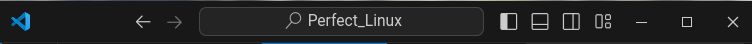

# Perfect_Linux
The perfect linux extensions kit
(Tested on GNOME 40 and above)

To know your GNOME version just use in your terminal:
```sh
gnome-shell --version
```

## How to install
Normally, clone the project, or download it as a zip.
Then you just have to run
```sh
chmod +x perfect_linux.sh &&
./perfect_linux.sh
```

## How to use

You can personalize every extensions in the extensions app!


If you can't find it, you can run:
```sh
gnome-extensions-app
```

Here you'll find all you need to make your life perfect with Linux!

# VSCODE
Vscode on Linux is somehow really ugly by default.
Here is a couple of change you can make to make them prettier:

```json
"window.titleBarStyle": "custom"
"window.customTitleBarVisibility": "auto"
"window.menuBarVisibility": "toggle"
```
It'll make the top bar look like this:


# Extension List

- [Blur my Shell](https://extensions.gnome.org/extension/3193/blur-my-shell/)
- [Dash to Dock](https://extensions.gnome.org/extension/307/dash-to-dock/)
- [Just Perfection](https://extensions.gnome.org/extension/3843/just-perfection/)
- [Media Controls](https://extensions.gnome.org/extension/4470/media-controls/)
- [User Themes](https://extensions.gnome.org/extension/19/user-themes/)
- [Vitals](https://extensions.gnome.org/extension/1460/vitals/)
- [Hanabi Extension](https://github.com/jeffshee/gnome-ext-hanabi)

And I use this user theme: [Orchis theme](https://github.com/vinceliuice/Orchis-theme)